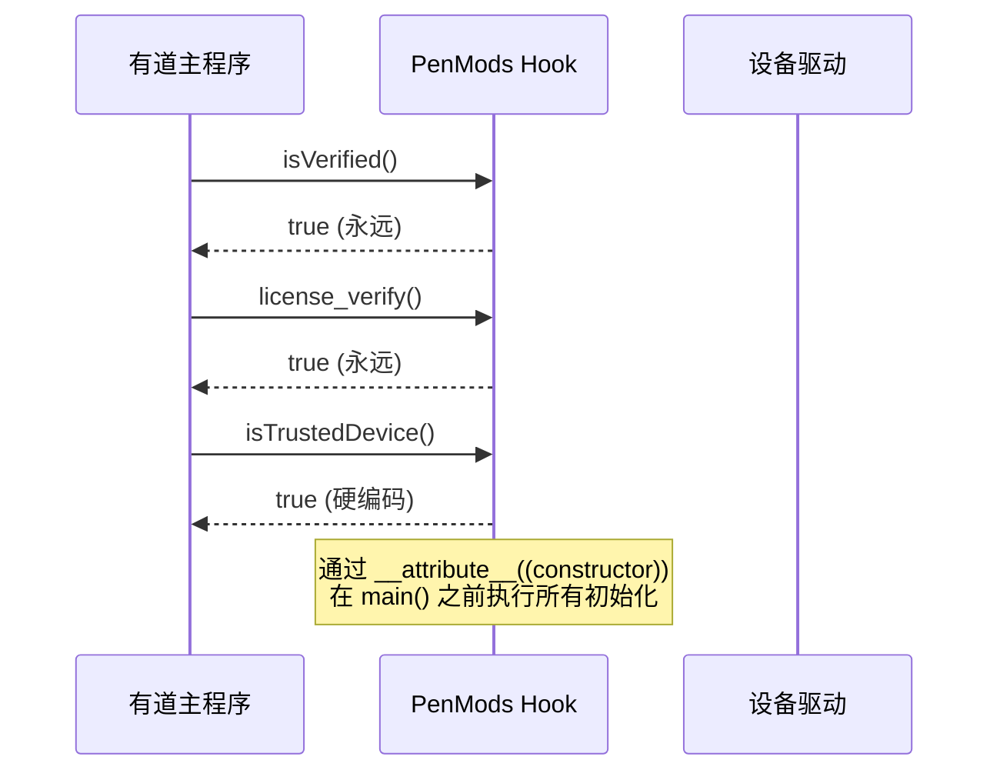
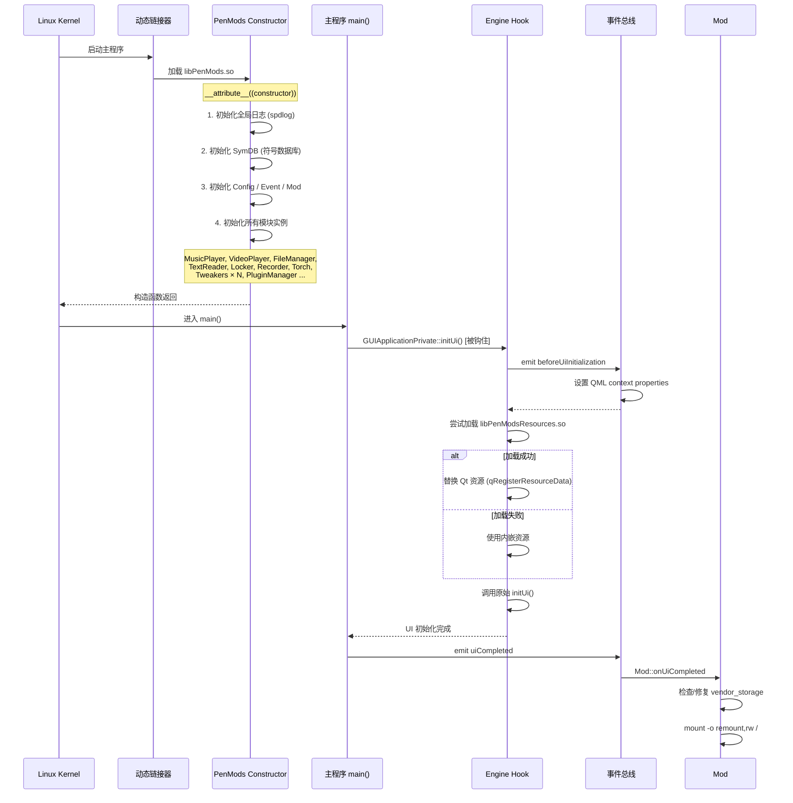

# PenMods 逆向工程分析报告

> 目标平台: 有道词典笔系列 (YDP02X / YDP032 / YDP035) / ARM64 Linux / Qt 5.15.2
>
> 分析日期: 2026-04-26

---

## 目录

- [1. 项目定位](#1-项目定位)
- [2. 整体架构](#2-整体架构)
- [3. 核心安全绕过](#3-核心安全绕过)
- [4. 功能解锁机制](#4-功能解锁机制)
- [5. 数据库优化](#5-数据库优化)
- [6. 媒体播放器接管](#6-媒体播放器接管)
- [7. 单词本增强](#7-单词本增强)
- [8. 模拟器环境支持](#8-模拟器环境支持)
- [9. UI初始化与资源替换](#9-ui初始化与资源替换)
- [10. 部署机制](#10-部署机制)
- [11. 代码调用流程](#11-代码调用流程)
- [12. 附件：IDA Pro结构体识别](#12-附件ida-pro结构体识别)

---

## 1. 项目定位

PenMods 是 **有道词典笔** 系列设备的第三方开源 Mod 框架，通过 **共享库注入**（LD_PRELOAD 或类似机制）实现对闭源二进制程序的运行时行为修改。项目使用自定义的 `PEN_HOOK` 宏系统，基于符号名拦截目标程序中的函数调用。

### 关键特性

| 维度 | 说明 |
|------|------|
| 注入方式 | `__attribute__((constructor))` 在 main() 前执行 |
| 钩子机制 | C++ 符号名 (mangled name) 匹配 |
| 目标架构 | `aarch64-linux-gnu` |
| GUI框架 | Qt 5.15.2 + QML |
| 资源替换 | 支持外部 .so 动态替换 Qt 资源 |
| 配置管理 | 运行时 JSON 配置文件 |

### 支持的设备型号

| 型号 | 产品名 | SKU |
|------|--------|-----|
| YDP021/022 | 满分版 16G | `OVERHEAD_D2_SKU_EXA_ADV` |
| YDP022 | 经典版 16G | `OVERHEAD_D2_SKU_CLA_ADV` |
| YDP032 | X3S 16G | `OVERHEAD_X3S_SKU_CHN_STD` |
| YDP035 | HLK 标准版 | `OVERHEAD_D3_SKU_HILINK_STD` |

---

## 2. 整体架构

```
┌──────────────────────────────────────────────────────────────┐
│                       用户态 (Userland)                        │
│                                                              │
│  ┌──────────────────────────────────────────────────────┐   │
│  │                  Plugin System                        │   │
│  │  ┌─────────┐ ┌──────────┐ ┌─────────┐ ┌──────────┐  │   │
│  │  │ ChatBot │ │ Hitokoto │ │  RIME   │ │ Plugins  │  │   │
│  │  └─────────┘ └──────────┘ └─────────┘ └──────────┘  │   │
│  ├──────────────────────────────────────────────────────┤   │
│  │                   File Manager                        │   │
│  │  ┌────────┐ ┌───────────┐ ┌──────────┐ ┌─────────┐  │   │
│  │  │ Music  │ │   Video   │ │   Text   │ │  Image  │  │   │
│  │  │ Player │ │   Player  │ │  Reader  │ │ Viewer  │  │   │
│  │  └────────┘ └───────────┘ └──────────┘ └─────────┘  │   │
│  ├──────────────────────────────────────────────────────┤   │
│  │                     Tweakers                          │   │
│  │  ┌────────────┐ ┌──────────┐ ┌──────────────────┐   │   │
│  │  │ DB Limiter │ │  Query   │ │ WordBook Tweaks  │   │   │
│  │  │ Keyboard   │ │  Logger  │ │ TextBook Helper  │   │   │
│  │  └────────────┘ └──────────┘ └──────────────────┘   │   │
│  ├──────────────────────────────────────────────────────┤   │
│  │            Helper / System / Recorder                 │   │
│  │  ┌──────────┐ ┌──────────┐ ┌──────────┐ ┌────────┐ │   │
│  │  │ AntiEmbs │ │ Network  │ │ Battery  │ │ Sound  │ │   │
│  │  │ Locker   │ │ Torch    │ │ Recorder │ │ Input  │ │   │
│  │  └──────────┘ └──────────┘ └──────────┘ └────────┘ │   │
│  ├──────────────────────────────────────────────────────┤   │
│  │           Common (事件总线 / 工具函数)                  │   │
│  │  ┌──────┐ ┌──────────┐ ┌────────┐ ┌────────────┐   │   │
│  │  │Event │ │Downloader│ │ Utils  │ │  Resource  │   │   │
│  │  └──────┘ └──────────┘ └────────┘ └────────────┘   │   │
│  ├──────────────────────────────────────────────────────┤   │
│  │     Base (符号数据库 / 指针系统)                       │   │
│  │  ┌──────────────┐ ┌────────────────────────────┐    │   │
│  │  │   SymDB      │ │       YPointer<T>          │    │   │
│  │  └──────────────┘ └────────────────────────────┘    │   │
│  ├──────────────────────────────────────────────────────┤   │
│  │               Mod Engine (Engine)                     │   │
│  │  ┌──────────────┐ ┌────────────┐ ┌────────────────┐ │   │
│  │  │ Res Repalce  │ │   Config   │ │  OTA Updater   │ │   │
│  │  └──────────────┘ └────────────┘ └────────────────┘ │   │
│  └──────────────────────────────────────────────────────┘   │
│                                                              │
│  ┌──────────────────────────────────────────────────────┐   │
│  │             目标程序 (有道词典笔)                      │   │
│  │  YoudaoDictPen (已打补丁)                              │   │
│  └──────────────────────────────────────────────────────┘   │
│                                                              │
│  ┌──────────────────────────────────────────────────────┐   │
│  │              系统服务 (System Services)                │   │
│  │  librkdev.so / ALSA / Wi-Fi / Bluetooth / DBus       │   │
│  └──────────────────────────────────────────────────────┘   │
│                                                              │
│  ┌──────────────────────────────────────────────────────┐   │
│  │                 Linux Kernel 4.4.159                  │   │
│  └──────────────────────────────────────────────────────┘   │
└──────────────────────────────────────────────────────────────┘
```

### 模块职责

| 层级 | 模块 | 职责 |
|------|------|------|
| **Engine** | `Engine.cpp` | UI初始化钩子、Qt资源替换 |
| **Mod** | `Mod.cpp` | 设备验证绕过、OTA更新、卸载 |
| **Base** | `SymDB`, `YPointer` | 符号解析、对象指针获取 |
| **Common** | `Event`, `Utils`, `Downloader` | 事件总线、系统命令、网络下载 |
| **Tweakers** | `ColumnDBLimiter` 等 | 数据库/查询/键盘的参数修改 |
| **FileManager** | `MusicPlayer` 等 | 媒体播放/文件管理/阅读器 |
| **Helper** | `AntiEmbs`, `NetworkSettings` | 防尴尬、网络设置 |
| **System** | `BatteryInfo`, `ASound` | 电池、音频、输入系统 |
| **Plugin** | `PluginManager` | 插件系统入口 |

---

## 3. 核心安全绕过

### 3.1 验证绕过流程



### 3.2 关键代码

```cpp
// Mod.cpp - 绕过所有验证
PEN_HOOK(bool, _ZNK15YSettingManager10isVerifiedEv, void* self) {
    return true;  // 始终返回已验证
}

PEN_HOOK(bool, license_verify) {
    return true;  // 始终通过许可证校验
}

bool Mod::isTrustedDevice() const {
    return true;  // 硬编码为信任设备
}
```

### 3.3 vendor_storage 自动修复

在 UI 初始化完成后，自动检测并修复缺失的硬件存储项：

```cpp
void Mod::onUiCompleted() const {
    // 检查并修复 VENDOR_COMPANY_ID 和 VENDOR_CUSTOM_ID_0E
    // 使用 shell 命令: vendor_storage -r/-w
    exec("vendor_storage -w VENDOR_CUSTOM_ID_0E -t string -i OVERHEAD_D2_SKU_EXA_ADV");
}
```

---

## 4. 功能解锁机制

### 4.1 原理

有道词典笔使用 `std::bitset<60>` 存储功能标志位。PenMods 通过钩住 `FT::InitFeature()` 函数，在初始化完成后手动设置额外的功能位。

```cpp
// Features.cpp
#define FEATURE_ENABLE(fea)  (supportFeatures |= 1UL << ((fea) & 0x3F))
#define FEATURE_DISABLE(fea) (supportFeatures |= 0UL << ((fea) & 0x3F))
#define FEATURE_HAS(fea)     (((1UL << (fea & 0x3F)) & supportFeatures.to_ulong()) != 0)

PEN_HOOK(void, _ZN2FT11InitFeatureEv) {
    origin();  // 调用原始的 InitFeature
    
    if (!mod::Mod::getInstance().isTrustedDevice()) {
        return;
    }
    
    // 从运行时符号获取 supportFeatures bitset
    auto& supportFeatures = *static_cast<std::bitset<60>*>(PEN_SYM("_ZN2FT17s_supportFeaturesE"));
    
    FEATURE_ENABLE(DictPenFeature::OXFORD);     // 牛津词典
    FEATURE_ENABLE(DictPenFeature::WEBSTER);    // 韦氏词典
    FEATURE_ENABLE(DictPenFeature::LANG_JPN);   // 日语支持
    FEATURE_ENABLE(DictPenFeature::LANG_KOR);   // 韩语支持
    FEATURE_ENABLE(DictPenFeature::KOJN);       // 单词本过滤
}
```

### 4.2 位运算详解

| 操作 | 含义 | 公式 |
|------|------|------|
| `FEATURE_ENABLE(fea)` | 启用功能 | `bits |= 1UL << (fea & 0x3F)` |
| `FEATURE_DISABLE(fea)` | 禁用功能 | `bits &= ~(1UL << (fea & 0x3F))` |
| `FEATURE_HAS(fea)` | 检查功能 | `(bits >> (fea & 0x3F)) & 1` |

`(fea) & 0x3F` 确保索引不超过 63（bitset 支持的最大位数）。

---

## 5. 数据库优化

### 5.1 查询限制提升

有道词典笔的数据库查询默认限制为 10 条结果。PenMods 将其提升至 80 条。

```cpp
// ColumnDBLimiter.cpp
#define LIMIT (80)

// 重写 limit 参数为 80
PEN_HOOK(uint64, _ZNK9YColumnDB11loadColumnsERK7QStringS2_iib, ...) {
    limit = LIMIT;
    return origin(self, a2, a3, a4, limit, a6);
}
```

### 5.2 被拦截的数据库查询

| 原始方法 | 功能 | 签名哈希 |
|----------|------|---------|
| `YColumnDB::loadColumns` | 加载栏目列表 | `_ZNK9YColumnDB11loadColumnsERK7QStringS2_iib` |
| `YHistoryDB::loadItems` | 加载历史记录 | `_ZNK10YHistoryDB9loadItemsExi` |
| `YColumnDB::loadMedias` | 加载媒体列表 | `_ZNK9YColumnDB10loadMediasERK7QStringiiN12YEnumWrapper14Download_StateEb` |
| `YReadingDB::loadReadingSeries` | 加载阅读系列 | `_ZNK10YReadingDB17loadReadingSeriesEiibb` |
| `YTextBookDb::loadBlocks` | 加载教材区块 | `_ZNK11YTextBookDb10loadBlocksERK7QStringS2_iibb` |
| `YTextBookDb::loadBooks` | 加载教材书籍 | `_ZNK11YTextBookDb9loadBooksERK7QStringiib` |
| `YTextBookDb::loadTasks` | 加载教材任务 | `_ZNK11YTextBookDb9loadTasksERK7QStringiib` |
| `YWordbookDB::loadItems` | 加载单词本 | `_ZNK11YWordbookDB9loadItemsEx...` |

### 5.3 查询优化

在 YDP02X 型号上，将扫描查询转为小写以实现不区分大小写的搜索：

```cpp
// QueryTweaks.cpp
PEN_HOOK(uint64, _ZN14YResultManager11entryResultERK7QStringS2_S2_N12YEnumWrapper9PageIndexEib, ...) {
    if (mod::QueryTweaks::getInstance().getLowerScan()) {
        what = what.toLower();
    }
    return origin(self, what, a3, a4, a5, a6, a7);
}
```

---

## 6. 媒体播放器接管

### 6.1 内存数据结构

通过逆向工程的 `YColumnMediaEntity` 结构体（大小: 0x68 字节）：

```cpp
// MusicPlayer.cpp 中定义的结构体布局
struct YMediaEntity {                      // 基类
    char          unk[10];                 // +0x00
    QString       mMediaId;                // +0x10
    QString       mOwnerId;                // +0x18
    QString       mTitle;                  // +0x20
    int           mDuration;               // +0x28
    DownloadState mDownloadState;          // +0x2C
    QString       mUrl;                    // +0x30
    QString       mLocalFile;              // +0x38
    QString       mLrcFile;                // +0x40
    LrcState      mLrcState;              // +0x48
    bool          mSrcAudioVisible;       // +0x4C
};

struct YColumnMediaEntity : public YMediaEntity {
    int     mId;                           // +0x50
    QString mColumnId;                     // +0x58
    int     mProgress;                     // +0x60
    bool    mIsDir;                        // +0x64
};
// 总大小: 0x68 = 104 字节
static_assert(sizeof(YColumnMediaEntity) == 0x68);
```

### 6.2 播放接管流程

```mermaid
flowchart TD
    A[用户选择本地音频文件] --> B{是否在接管模式?}
    B -->|是| C[MusicPlayer::play(idx)]
    B -->|否| Z[使用系统播放器]
    
    C --> D[构造伪造的 YColumnMediaEntity]
    D --> E[设置 fake_column_id]
    E --> F[查找同目录 .lrc 歌词文件]
    F --> G[调用 YMediaManager::playAudio]
    G --> H[显示播放器 UI]
    H --> I{播放状态检查}
    I -->|未播放| J[YMediaPlayerManager::onClickedPlay]
    I -->|播放中| K[结束]
    
    subgraph 播放控制（已接管）
        L[onClickedPrev] --> M{RANDOM 模式?}
        M -->|是| N[clickRand]
        M -->|否| O[clickPrev]
        
        P[onClickedNext] --> Q{RANDOM 模式?}
        Q -->|是| R[clickRand]
        Q -->|否| S[clickNext]
        
        T[onSoundEnd] --> U{播放模式}
        U -->|ORDER| V[clickNext]
        U -->|RANDOM| W[clickRand]
        U -->|SINGLE| X[重播当前]
        U -->|SINGLE_SHOT| Y[切换为 STOPPED]
    end
```

### 6.3 关键代码分析

**构造虚拟媒体实体**:

```cpp
void MusicPlayer::_play(const std::shared_ptr<QFileInfo>& file) {
    mIsTakeOver = true;
    
    // 1. 清除系统播放列表
    PEN_CALL(void, "_ZN19YMediaPlayerManager8wipeDataEv", void*)(
        YPointer<YMediaPlayerManager>::getInstance());
    
    // 2. 设置自定义 column ID
    PEN_CALL(bool, "_ZN7YGlobal23setAudioPlayingColomnIdERK7QString", void*, QString const&)(
        YPointer<YGlobal>::getInstance(), "myimport");
    
    // 3. 在堆上构造 YColumnMediaEntity
    auto memory = new char[sizeof(YColumnMediaEntity)];
    PEN_CALL(void, "_ZN18YColumnMediaEntityC2EP7QObject", void*, void*)(memory, nullptr);
    auto entity = reinterpret_cast<YColumnMediaEntity*>(memory);
    
    // 4. 填充字段
    entity->mId = mediaId;         // 自减 ID 避免与系统冲突
    entity->mMediaId = QString::number(mediaId);
    entity->mColumnId = PLAYER_FAKE_COLUMN_ID;  // "fake_column_hsxjsbw"
    entity->mDownloadState = DownloadState::SUCCEED;  // 标记为已下载
    entity->mLocalFile = file->absoluteFilePath();
    entity->mTitle = file->fileName();
    
    // 5. 查找对应歌词文件
    for (const auto& i : file->absoluteDir().entryInfoList()) {
        if (i.suffix().toLower() == "lrc" && i.completeBaseName() == matchName) {
            entity->mLrcFile = i.absoluteFilePath();
            break;
        }
    }
    
    // 6. 播放
    PEN_CALL(void*, "_ZN13YMediaManager9playAudioERK18YColumnMediaEntityb", void*, YColumnMediaEntity*, bool)(
        YPointer<YMediaManager>::getInstance(), entity, true);
}
```

### 6.4 播放模式枚举

```cpp
enum class AudioSequence {
    ORDER,        // 顺序播放
    RANDOM,       // 随机播放
    SINGLE,       // 单曲循环
    SINGLE_SHOT   // 单次播放
};
```

### 6.5 播放状态枚举

```cpp
enum class PlayState {
    PLAYING,      // 播放中
    PAUSED,       // 暂停
    STOPPED       // 停止
};
```

---

## 7. 单词本增强

### 7.1 短语/单词过滤

有道词典笔单词本支持按 `tabType` 分类，但默认没有短语/单词过滤功能。PenMods 通过 SQL 注入实现此功能：

```cpp
// WordBookTweaks.cpp
PEN_HOOK(QString, _ZNK18YWordbookDBPrivate15getLoadItemsCmdEx..., ...) {
    auto cmd = origin(a1, a2, tabType, limit, a5, a6, a7, rtn);
    // tabType:
    //   0 = 句子
    //   1 = 单词 (默认)
    //   2 = 单词 (Mod 添加)
    //   3 = 短语 (Mod 添加)
    
    if (mod::WordBookTweaks::getInstance().getPhraseTab()) {
        if (tabType == 2) {
            cmd.replace("ORDER BY", "AND word NOT LIKE '% %' ORDER BY");
        } else if (tabType == 3) {
            cmd.replace("ORDER BY", "AND word LIKE '% %' ORDER BY");
        }
    }
    return cmd;
}
```

### 7.2 不区分大小写

通过修改 SQL 查询中的 `=` 比较为 `COLLATE NOCASE`：

```cpp
connect(&Event::getInstance(), &Event::beforeDatabasePrepareAsyncQuery, [this](QString& query) {
    if (getNoCaseSensitive()) {
        query.replace("word = (:word)", "word = (:word) COLLATE NOCASE");
    }
});
```

### 7.3 导出 JSON 格式

导出的单词本文件路径: `/userdisk/Favorite/WordBook.json`

```json
{
  "version": 100,
  "data": {
    "Senior": {
      "apple": "... (有道高中生词典 JSON 内容)",
      "book": "..."
    },
    "PureEnglishAndExample": {
      "apple": "... (有道简明释义 JSON 内容)",
      "book": "..."
    }
  }
}
```

### 7.4 Bug 修复

修复 `YWordBookManager::wipeData()` 方法中缺少配置项的问题：

```cpp
// Bugfix: Missing "wbLanguageFitler" cfg item.
PEN_HOOK(uint64, _ZN16YWordBookManager8wipeDataEb, uint64 self, bool a2) {
    a2 = false;  // 阻止清除配置
    return origin(self, a2);
}
```

---

## 8. 模拟器环境支持

### 8.1 编译时条件

```cpp
// EmulatorTweaks.cpp
#if PL_QEMU
// 所有模拟代码仅在 PL_QEMU 标志打开时编译
#endif
```

### 8.2 系统调用模拟

`_console_run` 钩子是整个模拟环境的核心，它拦截所有 `exec()` / `popen()` 系统命令调用，根据命令哈希值返回预设结果：

```cpp
PEN_HOOK(int64_t, _console_run, const char* cmd, char* result) {
    switch (H(cmd)) {  // H() = 字符串哈希
    case H("vendor_storage -r VENDOR_CUSTOM_ID_0E ..."):
        strcpy(result, "OVERHEAD_D2_SKU_EXA_ADV");
        break;
    case H("load_sys_cfg brightness"):
        strcpy(result, "99");
        break;
    // ... 更多 case
    default:
        spdlog::warn("BANNED executing: \"{}\"", cmd);
        return 0;  // 未知命令返回成功但无输出
    }
}
```

### 8.3 完整的模拟清单

| 系统调用 | 命令/函数 | 模拟返回值 |
|---------|-----------|-----------|
| OTA 更新状态 | `update_engine --misc=display` | `"0"` |
| 设备 SKU | `vendor_storage -r VENDOR_CUSTOM_ID_0E` | `OVERHEAD_D2_SKU_EXA_ADV` |
| 型号 | `load_sys_cfg sku` | `OVERHEAD_D2_SKU_EXA_ADV` |
| 亮度值 | `load_sys_cfg brightness` | `99` |
| 音频设备 | `playback_dev_ctrl show` | `spk` (扬声器) |
| 音量 | `load_sys_cfg spk-volume` | `30` |
| 系统版本 | `cat /Version` | `2.1.2` |
| 内核版本 | `/bin/uname -r` | `4.4.159` |
| CPU 特性 | `cat /proc/cpuinfo` | `fp asimd evtstrm aes pmull sha1 sha2 crc32` |
| 蓝牙 | `hciconfig` | 空（无蓝牙） |
| 序列号 | `get_sn` | `2BC0000011451400000` |
| MAC 地址 | `get_mac` | `43:0b:6f:e2:71:e0` |
| 电池电量 | `get_battery_info` | 100%, 充电中 |
| Wi-Fi 状态 | `get_wifi_status` | 已连接, SSID="Emulator Environment" |
| 热点扫描 | `wifi_scan` | 1 个设备: "Emulator Environment" |

### 8.4 音频屏蔽

```cpp
// 阻止录音和播放引擎启动
PEN_HOOK(void*, _ZN13YRecordCenter18startRecordProcessEv, void* self) {
    return nullptr;  // 不启动录音进程
}

PEN_HOOK(void*, _ZN12YSoundCenter17startSoundProcessEv, void* self) {
    return nullptr;  // 不启动声音进程
}

// 所有播放接口返回0（静音）
PEN_HOOK(uint32, _ZN12YSoundCenter4playERK7QStringS2_S2_i, ...) { return 0; }
PEN_HOOK(uint32, _ZN12YSoundCenter8playFileERK7QString, ...) { return 0; }
PEN_HOOK(uint32, _ZN12YSoundCenter9playMusicERK7QStringxd, ...) { return 0; }
PEN_HOOK(uint32, _ZN12YSoundCenter12playFileDataERK7QString, ...) { return 0; }
```

### 8.5 数据库重定位

将物理设备的数据库路径映射到模拟器本地目录：

```cpp
PEN_HOOK(void*, _ZN8Database17ConnectionManager15setDatabaseNameERK7QString, void* self, QString const& path) {
    QString newPath = path;
    if (path.startsWith("/userdisk/database/")) {
        newPath = newPath.replace("/userdisk/database/", util::getModuleFileInfo().absolutePath());
    }
    return origin(self, newPath);
}
```

---

## 9. UI初始化与资源替换

### 9.1 初始化流程



### 9.2 Qt资源替换机制

PenMods 支持两种资源加载方式：

1. **外部资源库**（推荐）: `libPenModsResources.so` 放于 `/userdata/PenMods/`
2. **内嵌资源**（后备）: 编译时嵌入的 `qrc_qml.h`

```cpp
PEN_HOOK(void, _ZN22YGuiApplicationPrivate6initUiEv, QWindow** self) {
    auto& view = *(QQuickView*)*self;
    auto* context = view.rootContext();
    
    // 1. 发射 UI 初始化前事件
    emit mod::Event::getInstance().beforeUiInitialization(view, context);
    
    // 2. 尝试加载外部资源
    if (QFile::exists(ResourceLibPath)) {
        void* lib = dlopen(ResourceLibPath, RTLD_NOW);
        // 获取资源结构体指针: get_qt_resource_struct / _data / _name
    }
    
    // 3. 替换 Qt 资源系统
    qCleanupResources_qml();
    qRegisterResourceData(0x03, new_struct, new_name, new_data);
    
    // 4. 调用原始 initUi
    origin(self);
}
```

### 9.3 QML Context Properties

在 UI 初始化前，以下 C++ 对象被注册到 QML 上下文（可通过 QML 直接访问）：

| QML属性名 | C++类 | 功能 |
|-----------|-------|------|
| `mod` | `Mod` | Mod 主接口 (版本/构建/重启/卸载) |
| `musicPlayer` | `MusicPlayer` | 音乐播放器控制 |
| `videoPlayer` | `VideoPlayer` | 视频播放器控制 |
| `textReader` | `TextReader` | 文本阅读器 |
| `fileManager` | `FileManager` | 文件管理器 |
| `imageViewer` | `ImageViewer` | 图片查看器 |
| `workBookTweaks` | `WordBookTweaks` | 单词本增强设置 |
| `queryTweaks` | `QueryTweaks` | 查询设置 |
| `columnDb` | `ColumnDBLimiter` | 数据库限制设置 |
| `batteryInfo` | `BatteryInfo` | 电池信息 |
| `locker` | `Locker` | 应用锁 |

---

## 10. 部署机制

### 10.1 安装流程

```
1. 备份原主程序 -> YoudaoDictPen.original_bak
2. 修改主程序加载 PenMods 共享库
3. 将 libPenMods.so 和 libPenModsResources.so 放置到目标路径
4. OTA 更新通过 update_v2.0.x.zip 分发
```

### 10.2 卸载流程

```cpp
void Mod::uninstall() {
    // 1. 检查备份是否存在
    // 2. 删除修改后的主程序
    // 3. 将备份重命名为原主程序名
    // 4. 删除 libPenMods.so
    // 5. 重启进程 (std::terminate())
}
```

### 10.3 启动自动修复

```cpp
void Mod::onUiCompleted() const {
    // 自动修复 vendor_storage 缺失项
    // 设置根文件系统为读写模式
    exec("mount -o remount,rw /");
}
```

### 10.4 配置管理

配置通过 `Config` 类管理，以 JSON 格式存储在设备上。所有 Tweaker 模块在构造函数中读取配置：

```cpp
// 示例: ColumnDBLimiter 配置读取
ColumnDBLimiter::ColumnDBLimiter() {
    mCfg = Config::getInstance().read(mClassName);  // 读取 "ColumnDBLimiter" 节
    mPatch = mCfg["patch"];  // 是否启用补丁
}
```

---

## 11. 代码调用流程

### 11.1 完整启动流程

```
main() 入口
  │
  ├── __attribute__((constructor)) (Mod.cpp)
  │   ├── spdlog 初始化
  │   ├── SymDB::createInstance()
  │   ├── Config::createInstance()
  │   ├── Mod::createInstance()
  │   ├── Event::createInstance()
  │   ├── YPointerInitializer::createInstance()
  │   ├── Updater::createInstance()
  │   ├── Downloader::createInstance()
  │   ├── Resource::createInstance()
  │   ├── MusicPlayer / VideoPlayer / TextReader / FileManager / ImageViewer / ExternalPlayer
  │   ├── AntiEmbs / DeveloperSettings / NetworkSettings / ServiceManager
  │   ├── Locker
  │   ├── AudioRecorder
  │   ├── BatteryInfo / InputDaemon / ScreenManager / ASound
  │   ├── Torch
  │   ├── ColumnDBLimiter / KeyBoard / LoggerMonitor / QueryTweaks / TextBookHelper / WordBookTweaks
  │   ├── hitokoto::Hitokoto
  │   ├── chatbot::ChatBot
  │   ├── rime::Backend
  │   └── PluginManager
  │
  ├── main() 业务逻辑
  │   └── YGuiApplicationPrivate::initUi() [钩子]
  │       ├── emit Event::beforeUiInitialization(view, context)
  │       ├── 设置所有 QML context properties
  │       ├── 替换 Qt 资源系统
  │       └── origin(self) [调用原始 initUi]
  │
  └── UI 完成后
      └── emit Event::uiCompleted
          └── Mod::onUiCompleted()
              ├── 自动修复 vendor_storage
              └── 挂载根文件系统读写
```

### 11.2 钩子列表总览

| 文件 | 钩子函数 | 功能 |
|------|---------|------|
| `Mod.cpp` | `YSettingManager::isVerified` | 绕过验证 |
| `Mod.cpp` | `license_verify` | 绕过许可证 |
| `Engine.cpp` | `YGuiApplicationPrivate::initUi` | UI 初始化 + 资源替换 |
| `Features.cpp` | `FT::InitFeature` | 功能解锁 |
| `ColumnDBLimiter.cpp` | `YColumnDB::loadColumns` | 提升查询限制 |
| `ColumnDBLimiter.cpp` | `YHistoryDB::loadItems` | 提升查询限制 |
| `ColumnDBLimiter.cpp` | `YColumnDB::loadMedias` | 提升查询限制 |
| `ColumnDBLimiter.cpp` | `YReadingDB::loadReadingSeries` | 提升查询限制 |
| `ColumnDBLimiter.cpp` | `YTextBookDb::*` × 4 | 提升查询限制 |
| `ColumnDBLimiter.cpp` | `YWordbookDB::loadItems` | 提升查询限制 |
| `QueryTweaks.cpp` | `YResultManager::entryResult` | 查询转小写 |
| `WordBookTweaks.cpp` | `YWordBookManager::wipeData` | Bug 修复 |
| `WordBookTweaks.cpp` | `YWordbookDBPrivate::getLoadItemsCmd` | 短语过滤 |
| `WordBookTweaks.cpp` | `YWordBookManager::doExport` | 导出接管 |
| `MusicPlayer.cpp` | `YMediaManager::clickMedia` | 设置接管标记 |
| `MusicPlayer.cpp` | `YMediaPlayerManager::onClickedPrev` | 上一曲接管 |
| `MusicPlayer.cpp` | `YMediaPlayerManager::onClickedNext` | 下一曲接管 |
| `MusicPlayer.cpp` | `YMediaPlayerManager::onSoundEnd` | 播放结束接管 |
| `EmulatorTweaks.cpp` | `_console_run` × 1 + 驱动函数 × 14 | QEMU模拟 |

---

## 12. 附件：IDA Pro结构体识别

通过 IDA Pro MCP 工具连接后，识别出以下主要结构体类型（共计 1159 个）：

| 结构体 | 用途 |
|--------|------|
| `YColumnMediaEntity` (0x68B) | 媒体实体 |
| `YMediaEntity` (基类) | 媒体基类 |
| `YWordBookManager` | 单词本管理器 |
| `YWordbookDB` | 单词本数据库 |
| `YColumnDB` | 栏目数据库 |
| `YHistoryDB` | 历史记录数据库 |
| `YReadingDB` | 阅读数据库 |
| `YTextBookDb` | 教材数据库 |
| `YMediaPlayerManager` | 媒体播放器管理器 |
| `YMediaManager` | 媒体管理器 |
| `YGlobal` | 全局管理器 |
| `YSettingManager` | 设置管理器 |
| `YDictQueryEngine` | 词典查询引擎 |
| `YResultManager` | 扫描结果管理器 |
| `YCapture` | 摄像头管理 |
| `YRecordCenter` | 录音中心 |
| `YSoundCenter` | 声音中心 |
| `YSpeechManager` | 语音管理器 |
| `YLoginManager` | 登录管理器 |
| `YWifiManager` | Wi-Fi 管理器 |
| `YBatteryManager` | 电池管理器 |
| `YSystemBase` | 系统基类 |
| `Database::ConnectionManager` | 数据库连接管理器 |
| `Database::AsyncQueryResult` | 异步查询结果 |
| `YEnumWrapper` | 枚举包装器 |

---

## 附录 A：编译选项

```cmake
// 构建标志
PL_BUILD_YDP02X    // 目标设备为 YDP02X 系列
PL_QEMU            // 启用 QEMU 模拟器兼容
PL_DEBUG           // 启用调试日志
```

## 附录 B：文件路径约定

| 路径 | 用途 |
|------|------|
| `/userdata/PenMods/libPenMods.so` | PenMods 主共享库 |
| `/userdata/PenMods/libPenModsResources.so` | 外部 Qt 资源库（可选） |
| `/userdisk/Favorite/WordBook.json` | 单词本导出文件 |
| `YoudaoDictPen.original_bak` | 主程序备份（同目录） |
| `/userdisk/database/` | 设备数据库路径（QEMU 时重定向） |